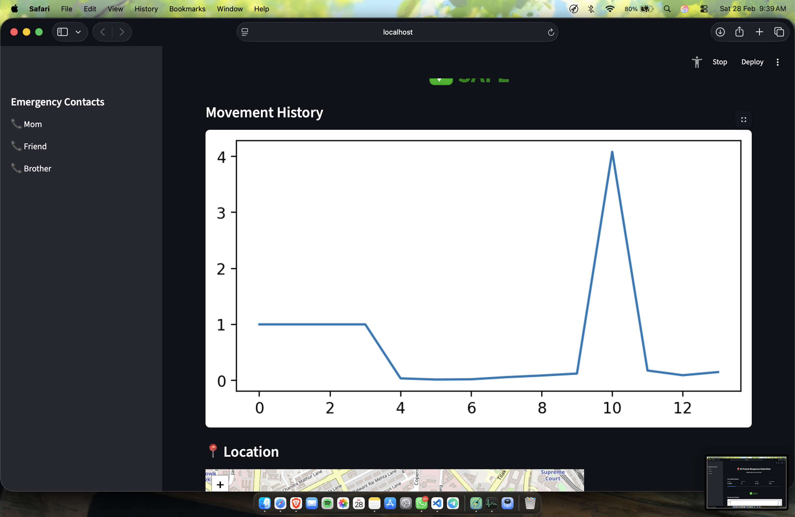
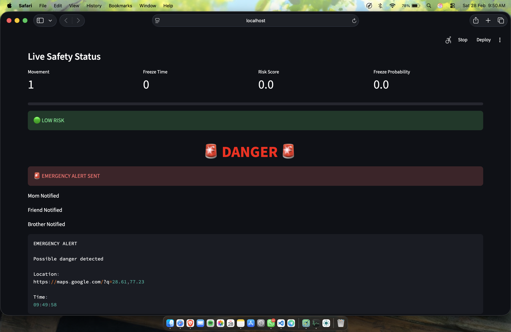
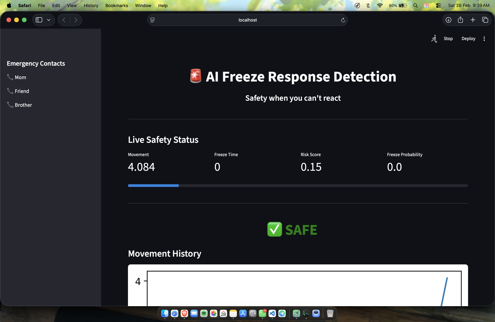
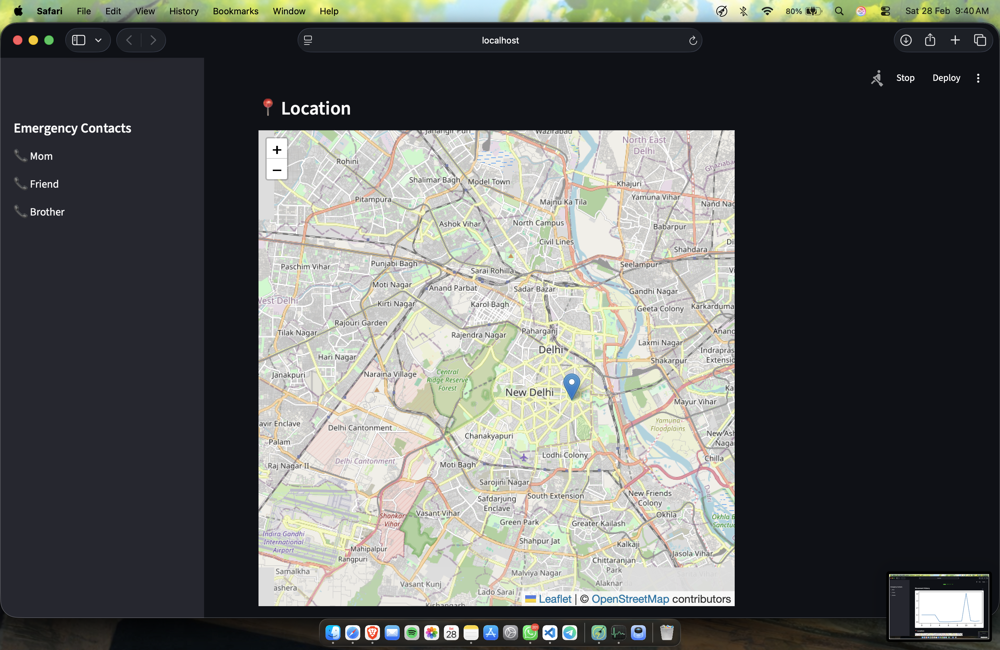

⭐ Real Sensors | 🤖 AI Powered | 🚨 Autonomous Alerts
# 🚨 AI Freeze Response Detection System
### *Safety when you can't react.*

An AI-powered women safety system that automatically detects fear-induced **freeze response** using smartphone sensors and sends emergency alerts **without manual interaction**.

---

## 🌟 Project Overview

Most safety apps require users to press an SOS button.

But in dangerous situations, victims often experience a **freeze response**, making it impossible to react.

This system detects:

✔ Sudden immobility  
✔ Panic movement patterns  
✔ Behavioral anomalies  

and automatically triggers emergency alerts.

---

## 🧠 Key Features

### 🤖 AI Freeze Detection
Detects freeze state using machine learning.

### 📱 Real Phone Sensors
Uses smartphone accelerometer via Phyphox.

### ⚠ Panic Detection
Detects sudden movement followed by immobility.

### 🚨 Automatic Alerts
Triggers alerts without user interaction.

### 📊 Live Dashboard
Real-time monitoring using Streamlit.

### 📍 Location Tracking
Shows live user location.

### 📲 Emergency SMS Simulation
Simulates alert messages to emergency contacts.

---

## 🏗 System Architecture
Smartphone Sensors
↓
Accelerometer Data
↓
AI Freeze Detection Model
↓
Risk Scoring Engine
↓
Emergency Alert System
↓
Streamlit Dashboard

---

## 📊 Technologies Used

| Technology | Purpose |
|----------|---------|
| Python | Core Logic |
| Streamlit | Dashboard |
| Scikit-Learn | AI Model |
| Phyphox | Sensor Data |
| Matplotlib | Graphs |
| Folium | Maps |
| Requests | Sensor API |

---

## 📱 Real Sensor Integration

This project uses **real accelerometer data**.

Sensors are streamed using:

Phyphox App → WiFi → Streamlit AI Model

---

## 🚀 How to Run

### 1️⃣ Install Requirements

pip install -r requirements.txt

---

### 2️⃣ Start Phyphox

On phone:
Acceleration without g
→ Start
→ Enable Remote Access

---

### 3️⃣ Run App

streamlit run app.py

---

## 🎯 Demonstration

### SAFE State

- Normal movement
- Low risk score

### Panic Detection

- Sudden shaking
- Immobility detected

### Freeze Detection

- No movement
- Risk increases

### Emergency Alert

- SMS simulation triggered

---

## 🧪 AI Model

Features used:

- Movement
- Audio (simulated)
- Freeze duration

Model:
Random Forest Classifier

---

## 📈 Innovation

This project introduces:

✔ Autonomous safety detection  
✔ Freeze response detection  
✔ Panic pattern recognition  
✔ Real sensor AI integration  

---

## 🏆 Hackathon Value

This project solves a **real-world safety gap**.

Unlike traditional apps:

| Traditional Apps | This Project |
|-----------------|-------------|
Manual SOS | Automatic detection |
User action required | No interaction needed |
Reactive | Proactive |

---

## 🔮 Future Improvements

- Smartwatch integration
- Heart rate monitoring
- Real SMS alerts
- Police integration
- Cloud deployment

---

## 👨‍💻 Author

Manjeet Muduli

---

## ⭐ Tagline

> **Safety when you can't react.**
